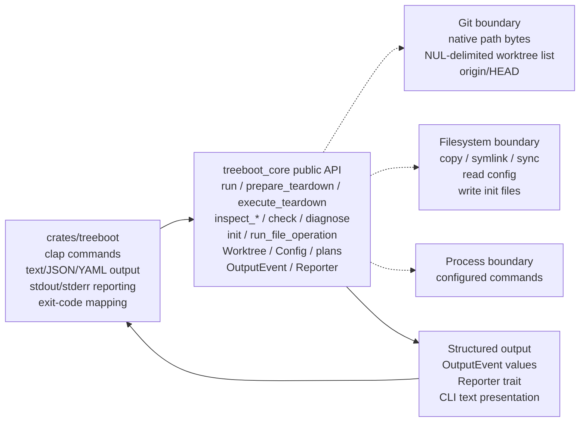
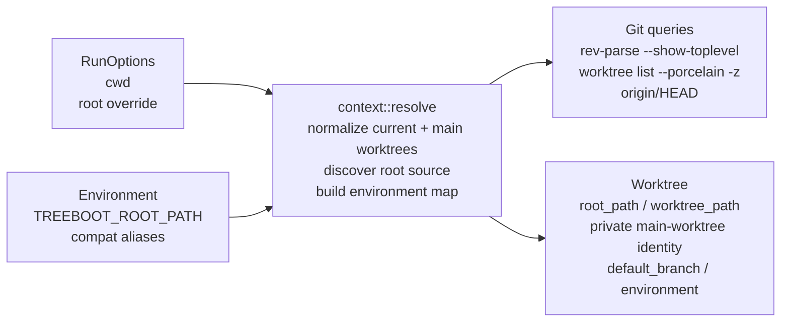
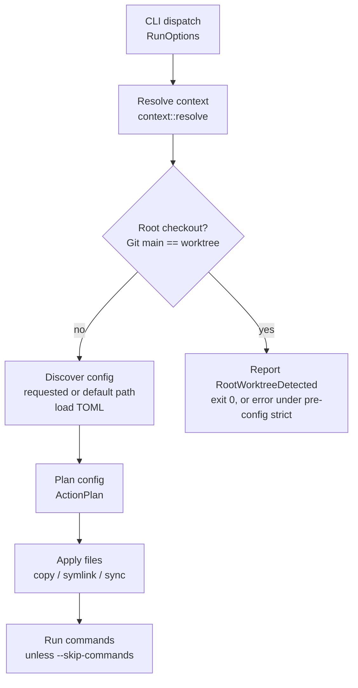
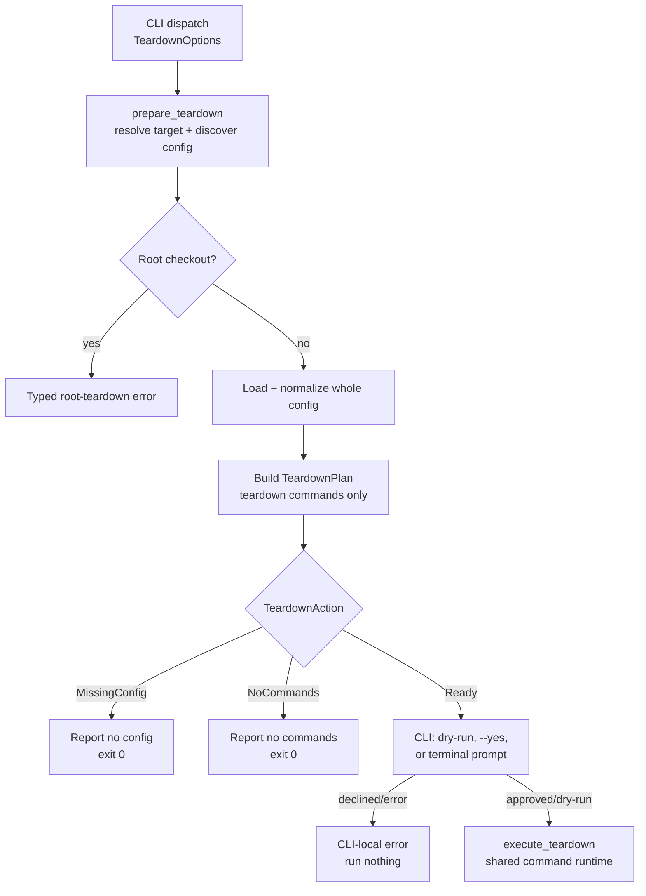
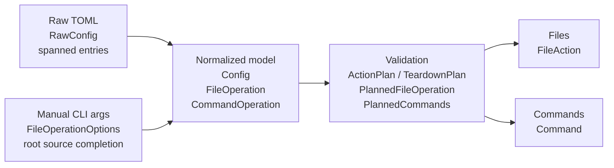
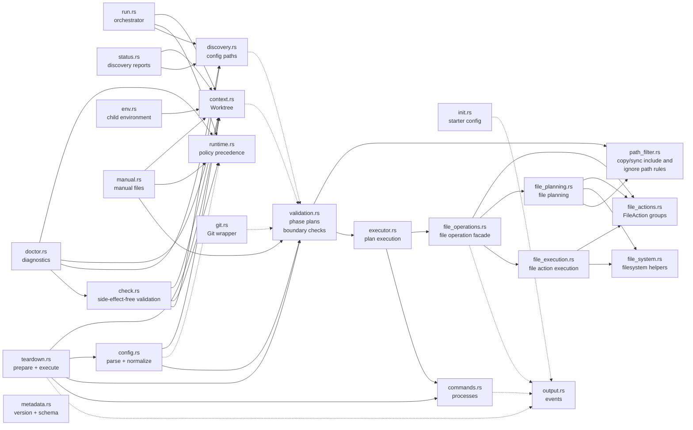

# treeboot Implementation Architecture

`treeboot` is a Rust CLI and public core library for bootstrapping Git worktrees
and running explicit pre-removal teardown commands from a repo-local contract.
The binary crate owns argument parsing, teardown confirmation, and presentation;
the core crate owns discovery, normalization, validation, planning, and
execution.

**Tags:** CLI adapter, Public core library, Validated action plans, Structured
output, Git worktree anchored

## Workspace boundary: Crates And Responsibilities

The workspace has one thin binary crate and one reusable library crate. Keep
behavior in core unless it is purely CLI presentation.

The high-level system map shows CLI arguments flowing into treeboot-core APIs.
Core modules call Git, filesystem, and shell process boundaries, then emit
output events.



_Core owns behavior and side effects. The CLI converts arguments into core
option structs and prints core output events._

### `treeboot` binary crate

- Defines `clap` commands and value enums.
- Converts CLI structs into core option structs.
- Prints durable `OutputEvent::message()` lines to stdout and handles
  structured-only lifecycle events for interactive file-operation progress.
- Renders inspection reports as text, JSON, or YAML.
- Prints errors to stderr and maps exit codes.
- Detects terminal stdin and owns teardown prompt I/O and refusal errors.
- Generates shell completion registration scripts.

### `treeboot-core` library crate

- Discovers Git worktree context and repo root source.
- Discovers config files.
- Parses and normalizes declarative TOML config.
- Builds separate validated bootstrap `ActionPlan` and command-only
  `TeardownPlan` values.
- Executes bootstrap plans through `Executor` and both command phases through
  one shared command runtime.
- Prepares immutable teardown plans without reading stdin or deciding approval.
- Exposes command-shaped facades for view-only inspection and validation.
- Embeds generated schema and spec-version assets for installed binaries.
- Provides typed errors and structured output events.

## Entry points: Command Surface

Most commands map to a small public core API. The default `treeboot` invocation
is an alias for `treeboot run`. The core API has two layers: command-shaped
facade functions for full treeboot behavior, and composable primitives for
callers that want to discover a `Worktree`, load a `LoadedConfig`, build an
`ActionPlan`, and execute it themselves.

| CLI command                        | Core API                                                                                                 | Primary modules                                                                                             | Side effects                                                                                                         |
| ---------------------------------- | -------------------------------------------------------------------------------------------------------- | ----------------------------------------------------------------------------------------------------------- | -------------------------------------------------------------------------------------------------------------------- |
| `treeboot`, `treeboot run`         | `run(RunOptions, Reporter)`                                                                              | `run`, `runtime`, `context`, `discovery`, `config`, `validation`, `executor`, `file_operations`, `commands` | May apply file operations and run configured bootstrap commands.                                                     |
| `treeboot teardown`                | `prepare_teardown(TeardownOptions, Reporter)` then `execute_teardown(...)`                               | `teardown`, `context`, `discovery`, `config`, `validation`, `commands`, `output`                            | Preparation is side-effect-free except reporting; execution may run teardown commands, but never removes a worktree. |
| `treeboot status`, `info`          | `inspect_status(StatusOptions)`; `inspect_status_snapshot(StatusOptions)` for serializable callers       | `status`, `context`, `discovery`, `config`                                                                  | View-only. Reports worktree, root, and config discovery without parsing config.                                      |
| `treeboot version`                 | `treeboot_version_info()`, `version_info(...)`                                                           | `metadata`                                                                                                  | View-only. Reports package and implemented spec versions.                                                            |
| `treeboot copy`, `symlink`, `sync` | `run_file_operation(FileOperationOptions, Reporter)`                                                     | `manual`, `runtime`, `context`, `config`, `validation`, `executor`, `file_operations`                       | Applies one manual file-operation batch. Skips configured actions, but loads config policy when present.             |
| `treeboot config`                  | `inspect_config(ConfigOptions)`                                                                          | `config`, `runtime`, `context`, `validation`                                                                | View-only. Prints normalized config and phase-labelled validation warnings.                                          |
| `treeboot check`                   | `check(CheckOptions)`                                                                                    | `check`, `runtime`, `context`, `discovery`, `config`, `validation`                                          | View-only. Validates bootstrap and teardown phases without applying effects.                                         |
| `treeboot init`                    | `init(InitOptions, Reporter)`                                                                            | `init`, `context`, `output`                                                                                 | Writes a starter config.                                                                                             |
| `treeboot schema`                  | `config_schema_json()`                                                                                   | `metadata`                                                                                                  | View-only unless `--output` is used. Prints or writes the bundled config schema.                                     |
| `treeboot doctor`                  | `diagnose(DoctorOptions)`                                                                                | `doctor`, `runtime`, `context`, `discovery`, `config`, `validation`                                         | View-only. Reports diagnostic statuses for discovery and validation, including strict diagnostics when requested.    |
| `treeboot env`                     | `inspect_env(EnvOptions)`                                                                                | `env`, `context`                                                                                            | View-only. Reports child environment variables passed to configured commands.                                        |
| `treeboot completions`             | CLI-owned completion registration; `file_operation_source_candidates(...)` for dynamic source completion | `main.rs`, `commands/completions.rs`, `manual`                                                              | Prints shell registration. Dynamic source candidates delegate to core.                                               |

## Anchors: Runtime Context

Almost every core flow starts by resolving the Git worktree, root source
checkout, default branch, and treeboot-owned environment.

The worktree resolution graph shows how `cwd`, an optional root override,
environment aliases, and Git worktree queries build a `Worktree`.



_Root source precedence is explicit `--root`, then treeboot-compatible
environment aliases, then Git's main worktree. Git's actual main-worktree
identity is always discovered independently so source-root overrides cannot
change root-target classification._

`git.rs` keeps Git-discovered filesystem paths in platform-native form. On Unix,
path output remains raw bytes through parsing and conversion; only branch names
and diagnostic stderr use ergonomic lossy text conversion. Main-worktree records
use Git's NUL-delimited porcelain format so quoting and embedded newlines are
unambiguous.

### Source root

File operation sources are anchored to `root_path`, normally Git's main worktree
or an explicit override.

### Target worktree

File operation targets and command working directories are anchored to
`worktree_path`. `Worktree::is_root()` is the single root-checkout predicate
used by run, manual operations, check, doctor, and teardown. It compares the
target with Git's actual main-worktree identity, not the overridable source
root. Teardown rejects a root target in core preparation; inspection commands
retain their existing strict/non-strict root behavior.

### Environment aliases

Configured commands receive treeboot variables plus compatibility aliases for
Codex, Conductor, and Superset flows.

## Primary orchestration: `treeboot run` Flow

Run mode first checks for root-checkout no-op behavior, then discovers config
before planning file and command work.



_The root-checkout branch reports `RootWorktreeDetected` and only becomes an
error when pre-config strict mode is active._

## Teardown orchestration: Prepare, Confirm, Execute

Teardown separates reusable core preparation and execution from binary-owned
approval. Preparation discovers and validates once; execution consumes the
approved immutable plan without rereading config.



_Core preparation emits discovery/no-op events. The binary alone detects a
terminal and reads confirmation. Core execution emits command lifecycle events
and never removes the worktree._

`PreparedTeardown` exposes the resolved context, `TeardownAction`, and a ready
plan when present. `TeardownAction` distinguishes `MissingConfig`, `NoCommands`,
and `Ready(Box<TeardownPlan>)`. `execute_teardown` accepts only a
`TeardownPlan`, so callers cannot accidentally execute a no-op preparation
result.

## Normalized data: Config And Manual Pipelines

Declarative config and manual file commands converge before file effects. Config
also carries separate bootstrap and teardown command collections.

The data model pipeline normalizes raw TOML and CLI options into `FileOperation`
and `CommandOperation` values. Validation builds the relevant phase plan;
`Executor` or teardown execution then emits `OutputEvent`.



_The normalized model is intentionally separate from the validated plan.
Parsing/defaulting happens before path-boundary validation._

### Declarative config path

1. `Config::discover_path` finds or validates a config path.
2. `Config::load_discovered` returns a `LoadedConfig`.
3. `Config::parse` parses raw TOML internally and returns normalized `Config`
   plus source spans.
4. `ActionPlan::from_manifest` validates files and bootstrap commands.
5. `TeardownPlan::from_manifest` independently validates teardown commands.

Both plans embed the same private `PlannedCommands` representation produced by
one command planner. `ActionPlan`, `TeardownPlan`, and planned operation entries
keep their fields private. External callers inspect validated plans through
accessors instead of constructing or mutating planned work directly.

Whole-config TOML parsing and normalized `Config` construction happen before
either semantic plan. Syntax, declaration-shape, unknown-field, and
normalization failures are shared fatal errors. Once `Config` exists, bootstrap
and teardown semantic planning are independent. One complete-config phase
validator evaluates both outcomes for `check`, `doctor`, and `config`, which
prevents each inspection path from duplicating aggregation, labels, or
precedence.

### Manual file path

1. CLI converts subcommand args to `FileOperationOptions`.
2. `FileOperation::from_manual_options` validates operation-specific options.
3. Config is loaded for top-level runtime policy when present.
4. Sources and target prefix become `FileOperation`s.
5. `ActionPlan::from_file_operations` validates files.
6. `Executor::execute_files` applies or dry-runs effects.

Config declarations, manual options, and public operation-specific constructors
share one internal normalized file-operation builder. Each frontend supplies its
own defaults and error attribution, then common path resolution, operation
setting validation, and final assembly produce the `FileOperation`.

## Core internals: Module Dependency Graph

The public API is re-exported from `lib.rs`; most implementation modules remain
private or crate-private.

The `treeboot-core` module graph shows public modules calling context and
discovery. Config feeds validation, and validated plans flow through the
executor before file operations and commands run.



_`run.rs` is the broad orchestrator. Manual file commands load top-level config
policy when present, skip configured commands, and reuse validation and
file-operation execution._

| Module               | Owns                                                                                                                                                                             | Does not own                                                                                                 |
| -------------------- | -------------------------------------------------------------------------------------------------------------------------------------------------------------------------------- | ------------------------------------------------------------------------------------------------------------ |
| `check.rs`           | Side-effect-free complete-config phase validation.                                                                                                                               | User-facing output formatting or execution.                                                                  |
| `context.rs`         | Git-derived root/worktree/default branch and env aliases.                                                                                                                        | Config parsing or side effects.                                                                              |
| `config.rs`          | TOML parsing, defaulting, normalized config data.                                                                                                                                | Boundary validation or execution.                                                                            |
| `doctor.rs`          | Diagnostic aggregation across discovery and validation.                                                                                                                          | Fixing problems or applying effects.                                                                         |
| `env.rs`             | Child environment inspection.                                                                                                                                                    | Config discovery beyond context resolution.                                                                  |
| `executor.rs`        | Sequencing validated bootstrap file and command execution.                                                                                                                       | Teardown dispatch, validation, or CLI policy.                                                                |
| `file_actions.rs`    | Concrete file action model, grouped operation actions, summary construction, and cross-action symlink warnings.                                                                  | Filesystem traversal or mutation.                                                                            |
| `file_operations.rs` | Operation-level file application facade, apply options/report types, planning lifecycle events, and planning/execution sequencing.                                               | Concrete planning decisions, action mutation details, or low-level filesystem helper implementation.         |
| `file_planning.rs`   | Planning concrete filesystem actions from validated file operations.                                                                                                             | Config semantics, CLI argument validation, action summary modeling, output lifecycle, or mutation execution. |
| `file_execution.rs`  | Executing planned file-action groups and emitting compact/verbose file-operation output events.                                                                                  | Planning filesystem actions or low-level filesystem helper implementation.                                   |
| `file_system.rs`     | Low-level filesystem inspection, comparison, metadata, writable-parent, copy, symlink, delete helpers, and permission-denied ownership warnings for file planning and execution. | File-operation policy, action grouping, or output lifecycle.                                                 |
| `path_filter.rs`     | Compiling and matching copy/sync include and ignore path rules, include viability pruning, and include-oriented source scans.                                                    | Config parsing, validation policy, or filesystem mutation.                                                   |
| `runtime.rs`         | Environment/config/CLI runtime policy precedence and conversion to validation options.                                                                                           | Config parsing, Git discovery, or side effects.                                                              |
| `validation.rs`      | Bootstrap and teardown plans, shared command planning, complete-config phase validation, path and environment boundary checks, and plan warnings.                                | Parsing or filesystem mutation.                                                                              |
| `commands.rs`        | Shared sequential bootstrap/teardown command spawning, execution-time cwd boundary enforcement, phase event selection, and dry-run output.                                       | Parsing command config or deciding phase contents.                                                           |
| `teardown.rs`        | Reporter-aware teardown preparation, no-op actions, and execution of validated teardown plans.                                                                                   | Terminal confirmation, worktree removal, or bootstrap execution.                                             |
| `metadata.rs`        | Embedded config schema, spec version, and version metadata helpers.                                                                                                              | Generating source files or reading runtime files.                                                            |
| `output.rs`          | Structured output events and message formatting.                                                                                                                                 | Choosing when events happen.                                                                                 |

## Filesystem effects: File Operation Engine

File execution is grouped by top-level validated file operation.
`file_operations.rs` is the operation-level facade: it emits planning lifecycle
events, asks `file_planning.rs` to plan each operation group, asks
`file_actions.rs` to add cross-action warnings, then asks `file_execution.rs` to
report or apply each group. `file_planning.rs` uses `file_system.rs` for
filesystem inspection and comparison. `file_execution.rs` delegates low-level
mutation helpers, including ownership-preservation warnings, to
`file_system.rs`. Compact mode reports lifecycle events and one summary per
group; verbose mode reports the concrete action stream.

### Planning inside `file_planning.rs`

- Skips optional missing sources before filesystem traversal.
- Plans copy and sync through shared tree traversal.
- Applies include and ignore gates independently during traversal: non-included
  files are skipped, and non-included directories only receive target actions
  when their subtree contains an included entry, keyed on included descendants
  rather than emitted actions so drifted ancestor metadata still repairs.
- Prunes directories that cannot contain include matches through
  `path_filter.rs` viability checks; unanchored include patterns fall back to
  the conservative full walk.
- Plans symlink creation and replacement separately.
- Plans sync delete actions for target-only paths. Delete planning stays
  include-unaware because validation rejects `include` with `delete = true`.
- Delegates grouped action summaries and cross-action warning aggregation to
  `file_actions.rs`.
- Delegates filesystem inspection and comparison helpers to `file_system.rs`.

### Applying actions

- `dry_run` emits would-apply events only.
- `force` controls supported replacements.
- `strict` converts some default skips into conflicts.
- Actual filesystem mutations happen through `file_execution.rs` after all
  actions plan, with low-level operations delegated to `file_system.rs`.
- Reporter failures become typed output errors.

```text
ActionPlan::files()
  -> file_operations::apply_file_operations
  -> file_planning::plan_file_operation_group
  -> plan_operation
  -> FileAction::{CreateDirectory, CopyFile, CreateSymlink, RepairMetadata, Delete, Skip, Warning}
  -> grouped PlannedFileOperationActions
  -> file_execution::execute_file_operation_group
  -> report OutputEvent file-operation lifecycle events
  -> report_dry_run(action) or apply_action(action)
  -> compact OutputEvent::FileOperationFinished summary
     or verbose OutputEvent::{FileWouldApply, FileApplied, FileMetadataApplied, FileWarning, ...}
```

## Process effects: Command Runtime

Bootstrap and teardown commands run sequentially in declaration order through
one phase-agnostic runtime. Parallel work is intentionally delegated to
project-local task runners.

### Planning

`validation.rs` uses one command-slice planner for both phases. It resolves
command cwd to the worktree, rejects cwd escapes, prevents command env entries
from overriding treeboot-owned environment variables, and retains declaration
attribution. The resulting `PlannedCommands` also retains the canonical worktree
boundary established at planning time. `ActionPlan` and `TeardownPlan` each
embed this private shared representation.

### Execution

`commands.rs` freshly resolves each command cwd and the live worktree root after
file operations for bootstrap and immediately before every spawn in both phases.
It requires the live root to equal the planning-time boundary and then rejects a
live cwd escape. This prevents a renamed worktree path replaced by an outside
symlink from redefining both sides of the containment check. The runtime then
builds either a shell process (`sh -c` or `cmd /C`) or a direct program
invocation and runs it in sequence.

`Executor` remains the bootstrap file-plus-command orchestrator and delegates
its command phase to this runtime. `teardown.rs` calls the same runtime directly
for an approved `TeardownPlan`; there is no second executor or mixed plan.
Central phase-to-`OutputEvent` selection keeps process spawning, environment,
cwd, and failure control flow single-source.

### Failure policy

`allow_failure` turns cwd resolution, cwd boundary, spawn, or non-zero exit
failures into phase-specific warning output. Otherwise failures become typed
command errors and stop the phase.

## Presentation: Output And Errors

Core reports structured events and typed errors. The CLI decides how those
become stdout, stderr, and process status.

| Surface          | Type         | Role                                                                                                                                                                                                                                                                   |
| ---------------- | ------------ | ---------------------------------------------------------------------------------------------------------------------------------------------------------------------------------------------------------------------------------------------------------------------- |
| `OutputEvent`    | Public enum  | Captures non-error user-visible events such as config detected, file applied, bootstrap/teardown command started, teardown no-op, and init created.                                                                                                                    |
| `Reporter`       | Public trait | Lets CLI and tests receive events without hard-coding stdout into the core implementation.                                                                                                                                                                             |
| `Error`          | Public enum  | Represents typed failure categories for Git, config, planning, file operations, commands, init, output, and environment.                                                                                                                                               |
| `StdoutReporter` | CLI adapter  | Prints durable `OutputEvent::message()` lines, manages structured file-operation lifecycle events as interactive progress when stdout and stderr are both terminals, and suppresses blank lifecycle messages from log output. Errors are printed separately by `main`. |

`OutputEvent::message()` is the durable text-log representation. Some
file-operation lifecycle events intentionally return an empty message because
they are structured presentation hooks for reporters rather than log lines.

### Public enum evolution

Public enums that represent extensible failures, lifecycle events, discovery
states, or command outcomes are `#[non_exhaustive]`. Downstream callers must use
wildcard match arms for `Error`, `OutputEvent`, `RunAction`, `CheckAction`,
`TeardownAction`, `FileOperationAction` and `PlanWarning`. Closed-domain
vocabularies remain exhaustive when enumerating the complete set is useful API
behavior: `FileOperationKind`, `SyncCompare`, `SymlinkMode`, `MetadataField`,
`CommandKind`, `DiagnosticStatus`, `PlanOrigin`, and `PlannedFileStatus`.

### Public struct evolution

Public structs in the normalized config graph, plus the resolved `Worktree`
context carried by `LoadedConfig`, are `#[non_exhaustive]`:

- `LoadedConfig`
- `Worktree`
- `Config`
- `ConfigRuntimeOptions`
- `FileOperation`
- `CommandOperation`
- `SourceSpan`

Downstream callers may read public fields but must use `..` when destructuring.
Stable constructors preserve programmatic creation without exposing exhaustive
struct literals: `Config::default()`, `Worktree::from_parts`, `SourceSpan::new`,
shell/direct `CommandOperation` constructors, and operation-specific
`FileOperation` constructors. Config parsing, manual file operations, and public
file constructors converge on one normalized operation builder.

This policy makes future additive fields source-compatible. Removing fields,
changing field types, or expanding intentionally closed config vocabulary enums
remains a deliberate compatibility decision. Command input and report structs
outside this normalized graph are not covered by this migration.

## Verification boundaries: Testing Architecture

Tests are split by behavior layer. Use core unit tests for pure helpers and CLI
integration tests for user-visible command behavior.

### Core unit tests

- Config parsing and normalization.
- Bootstrap `ActionPlan`, `TeardownPlan`, and complete-config phase validation.
- File action planning and application.
- Shared command labels, phase events, live cwd checks, and failure policy.
- Non-exhaustive construction replacements and source policy.
- Output event formatting.
- Inspection report construction and metadata helpers.

### CLI integration tests

- Run/teardown/config/init/manual command behavior.
- Status/check/doctor/env/schema/version command behavior.
- JSON and YAML output structure for inspection commands.
- Actual Git linked worktree fixtures.
- Stdout/stderr and exit status.
- Shell completion surface.
- Root-checkout edge cases.
- Teardown confirmation, no-op, targeting, and non-removal behavior.

### Generated artifacts

- JSON Schema is generated by a core example.
- The embedded config schema asset is copied from the checked-in schema.
- The embedded spec-version asset is generated from `docs/SPEC.md`.
- `mise run generate:check` guards freshness.
- `mise run check` is normal handoff validation.
- `mise run verify` adds broader CI/coverage checks.

## Change guide: Extension Points And Invariants

These are the boundaries to preserve when adding new behavior or refactoring
existing modules.

| If changing                   | Touch                                                                                                                                                     | Keep invariant                                                                                                                                                                                         |
| ----------------------------- | --------------------------------------------------------------------------------------------------------------------------------------------------------- | ------------------------------------------------------------------------------------------------------------------------------------------------------------------------------------------------------ |
| Config file format            | `docs/SPEC.md`, `config.rs`, schema generator, schema file, parser tests.                                                                                 | The spec is the contract; generated schema must be fresh.                                                                                                                                              |
| Runtime policy semantics      | `runtime.rs`, command facade modules, config/check/doctor/run/manual tests, spec when observable.                                                         | Config/env/CLI precedence must stay centralized and consistent across run-like commands.                                                                                                               |
| File operation behavior       | `config.rs`, `manual.rs`, `validation.rs`, `file_actions.rs`, `file_operations.rs`, `file_planning.rs`, `file_execution.rs`, `file_system.rs`, CLI tests. | Declarative config and manual commands must share planning and file execution semantics; keep policy, planning, action modeling, execution, and low-level filesystem helpers separated by module role. |
| Command runtime               | `config.rs`, `validation.rs`, `commands.rs`, `executor.rs`, `teardown.rs`, phase tests, spec.                                                             | Bootstrap and teardown share one planner/runtime; plans and output events stay phase-specific.                                                                                                         |
| Teardown workflow             | `teardown.rs`, CLI adapter, `validation.rs`, `commands.rs`, output/error types, spec.                                                                     | Prepare once, confirm only in the binary, execute the approved plan, and never remove the worktree.                                                                                                    |
| Public normalized structs     | `config.rs`, `context.rs`, public API tests, crate README, architecture policy.                                                                           | Growth-prone structs remain non-exhaustive and retain stable construction paths; closed-domain enums remain exhaustive.                                                                                |
| Inspection/reporting commands | core command facade module, CLI command adapter, output-format tests, spec.                                                                               | Core owns report data; CLI owns text/JSON/YAML rendering.                                                                                                                                              |
| Metadata and generated assets | `docs/SPEC.md`, `metadata.rs`, `scripts/generate-metadata.sh`, schema generator, asset files.                                                             | Generated assets must stay crate-local so installed binaries and published crates embed them.                                                                                                          |
| CLI-only surface              | `crates/treeboot/src/main.rs`, `crates/treeboot/src/commands/`, and CLI tests.                                                                            | CLI stays an adapter. Core owns reusable behavior and typed semantics.                                                                                                                                 |
| Output wording                | `output.rs`, CLI integration tests, spec if contractual.                                                                                                  | Structured events stay separate from command-line formatting decisions where practical.                                                                                                                |

This document describes the current implementation architecture. It is not a
replacement for [docs/SPEC.md](SPEC.md), which remains the user-visible
compatibility contract.
