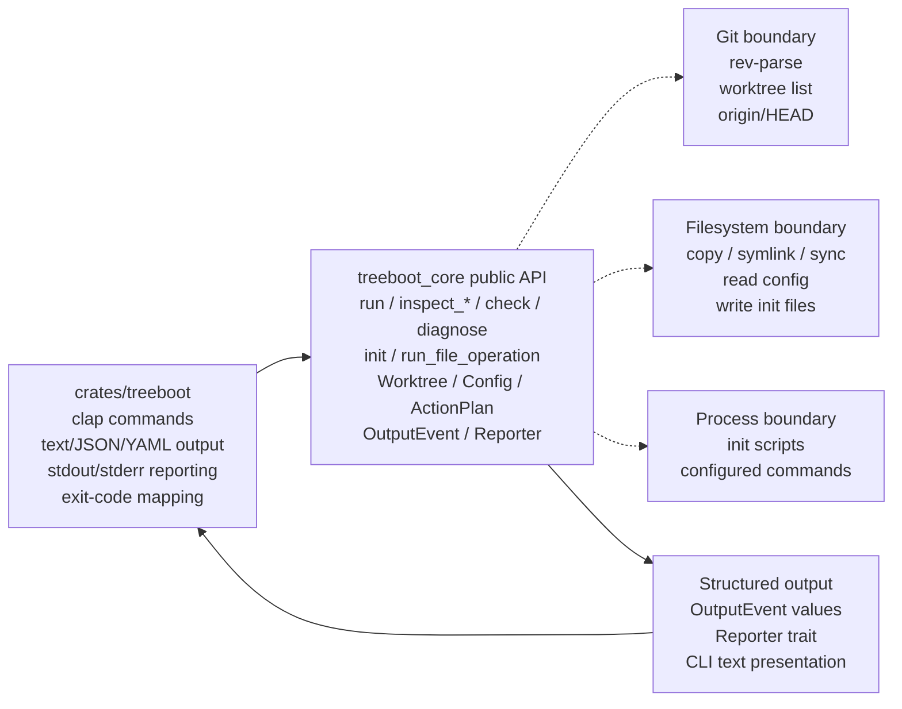
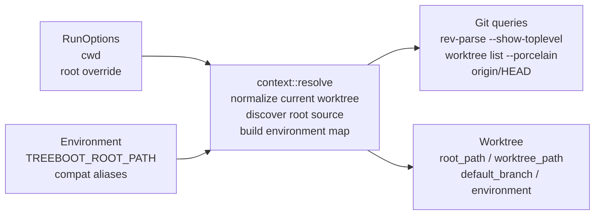
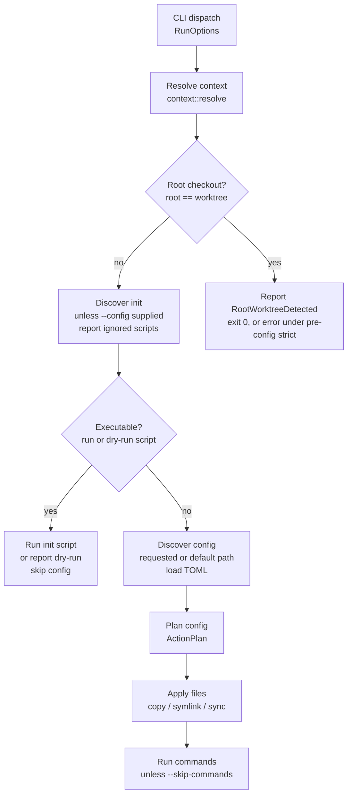
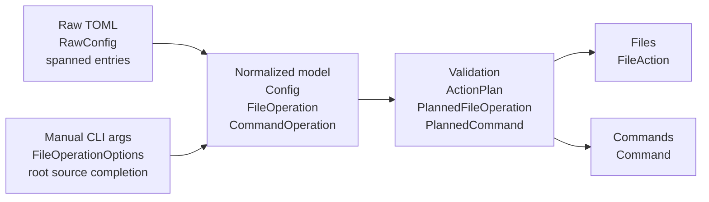
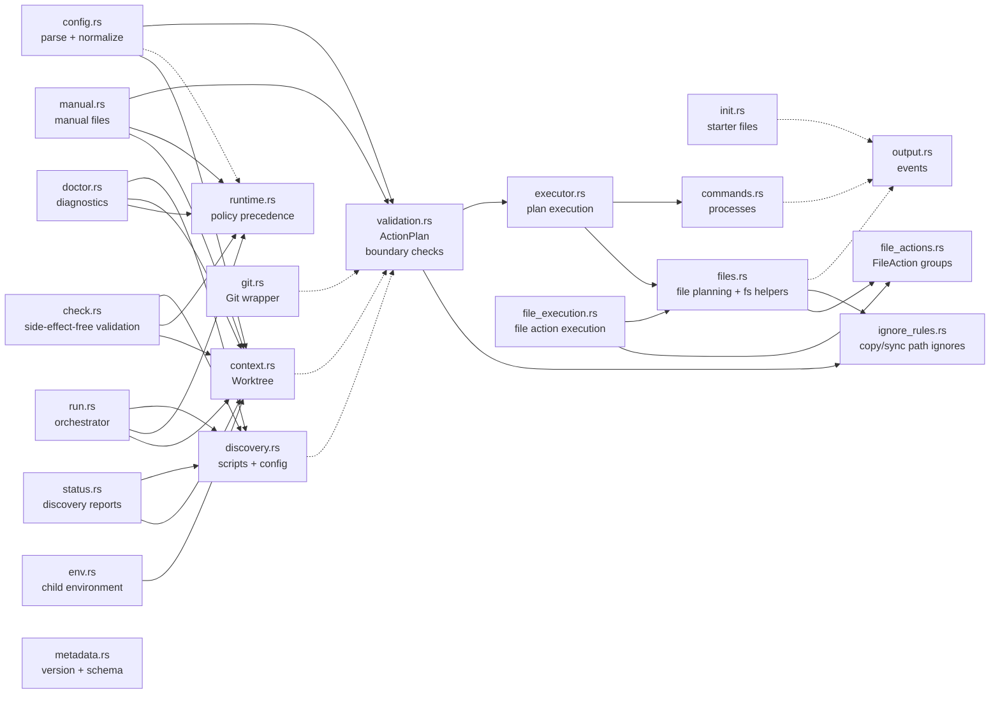

# treeboot Implementation Architecture

`treeboot` is a Rust CLI and public core library for bootstrapping Git worktrees
from a repo-local setup contract. The binary crate owns argument parsing and
presentation; the core crate owns discovery, normalization, validation,
planning, and execution.

**Tags:** CLI adapter, Public core library, Validated action plans, Structured
output, Git worktree anchored

## Workspace boundary: Crates And Responsibilities

The workspace has one thin binary crate and one reusable library crate. Keep
behavior in core unless it is purely CLI presentation.

The high-level system map shows CLI arguments flowing into treeboot-core APIs.
Core modules call Git, filesystem, and shell process boundaries, then emit
output events.



_Core owns behavior and side effects. The CLI converts arguments into core
option structs and prints core output events._

### `treeboot` binary crate

- Defines `clap` commands and value enums.
- Converts CLI structs into core option structs.
- Prints durable `OutputEvent::message()` lines to stdout and handles
  structured-only lifecycle events for interactive file-operation progress.
- Renders inspection reports as text, JSON, or YAML.
- Prints errors to stderr and maps exit codes.
- Generates shell completion registration scripts.

### `treeboot-core` library crate

- Discovers Git worktree context and repo root source.
- Discovers init scripts and config files.
- Parses and normalizes declarative TOML config.
- Builds validated `ActionPlan` values.
- Executes plans through `Executor`.
- Exposes command-shaped facades for view-only inspection and validation.
- Embeds generated schema and spec-version assets for installed binaries.
- Provides typed errors and structured output events.

## Entry points: Command Surface

Most commands map to a small public core API. The default `treeboot` invocation
is an alias for `treeboot run`. The core API has two layers: command-shaped
facade functions for full treeboot behavior, and composable primitives for
callers that want to discover a `Worktree`, load a `LoadedConfig`, build an
`ActionPlan`, and execute it themselves.

| CLI command                        | Core API                                                                                                 | Primary modules                                                                        | Side effects                                                                                                              |
| ---------------------------------- | -------------------------------------------------------------------------------------------------------- | -------------------------------------------------------------------------------------- | ------------------------------------------------------------------------------------------------------------------------- |
| `treeboot`, `treeboot run`         | `run(RunOptions, Reporter)`                                                                              | `run`, `runtime`, `context`, `discovery`, `config`, `validation`, `executor`, `files`, `commands` | May execute init scripts, apply file operations, and run configured commands.                                             |
| `treeboot status`, `info`          | `inspect_status(StatusOptions)`; `inspect_status_snapshot(StatusOptions)` for serializable callers       | `status`, `context`, `discovery`, `config`                                             | View-only. Reports worktree, root, config, and init-script discovery without parsing config.                              |
| `treeboot version`                 | `treeboot_version_info()`, `version_info(...)`                                                           | `metadata`                                                                             | View-only. Reports package and implemented spec versions.                                                                 |
| `treeboot copy`, `symlink`, `sync` | `run_file_operation(FileOperationOptions, Reporter)`                                                     | `manual`, `runtime`, `context`, `config`, `validation`, `executor`, `files`            | Applies one manual file-operation batch. Skips init scripts and configured actions, but loads config policy when present. |
| `treeboot config`                  | `inspect_config(ConfigOptions)`                                                                          | `config`, `runtime`, `context`, `validation`                                           | View-only. Prints normalized config and warns when run validation would fail.                                             |
| `treeboot check`                   | `check(CheckOptions)`                                                                                    | `check`, `runtime`, `context`, `discovery`, `config`, `validation`                     | View-only. Validates selected bootstrap behavior without running scripts or applying effects.                             |
| `treeboot init`                    | `init(InitOptions, Reporter)`                                                                            | `init`, `context`, `output`                                                            | Writes a starter config or executable init script.                                                                        |
| `treeboot schema`                  | `config_schema_json()`                                                                                   | `metadata`                                                                             | View-only unless `--output` is used. Prints or writes the bundled config schema.                                          |
| `treeboot doctor`                  | `diagnose(DoctorOptions)`                                                                                | `doctor`, `runtime`, `context`, `discovery`, `config`, `validation`                    | View-only. Reports diagnostic statuses for discovery and validation, including strict diagnostics when requested.         |
| `treeboot env`                     | `inspect_env(EnvOptions)`                                                                                | `env`, `context`                                                                       | View-only. Reports child environment variables passed to scripts and commands.                                            |
| `treeboot completions`             | CLI-owned completion registration; `file_operation_source_candidates(...)` for dynamic source completion | `main.rs`, `commands/completions.rs`, `manual`                                         | Prints shell registration. Dynamic source candidates delegate to core.                                                    |

## Anchors: Runtime Context

Almost every core flow starts by resolving the Git worktree, root source
checkout, default branch, and treeboot-owned environment.

The worktree resolution graph shows how `cwd`, an optional root override,
environment aliases, and Git worktree queries build a `Worktree`.



_Root source precedence is explicit `--root`, then treeboot-compatible
environment aliases, then Git's main worktree._

### Source root

File operation sources are anchored to `root_path`, normally Git's main worktree
or an explicit override.

### Target worktree

File operation targets and command working directories are anchored to
`worktree_path`.

### Environment aliases

Scripts and configured commands receive treeboot variables plus compatibility
aliases for Codex, Conductor, and Superset flows.

## Primary orchestration: `treeboot run` Flow

Run mode first checks for root-checkout no-op behavior, then prefers executable
init scripts unless a config file is explicit.

The run flow resolves context, handles root checkout, runs an executable init
script when present, or discovers config before planning file and command work.



_The root-checkout branch reports `RootWorktreeDetected` and only becomes an
error when pre-config strict mode is active._

## Normalized data: Config And Manual Pipelines

Declarative config and manual file commands converge before file effects. Config
also carries planned commands.

The data model pipeline normalizes raw TOML and CLI options into `FileOperation`
values. Validation builds an `ActionPlan`, then `Executor` emits `OutputEvent`.



_The normalized model is intentionally separate from the validated plan.
Parsing/defaulting happens before path-boundary validation._

### Declarative config path

1. `Config::discover_path` finds or validates a config path.
2. `Config::load_discovered` returns a `LoadedConfig`.
3. `Config::parse` parses raw TOML internally and returns normalized `Config`
   plus source spans.
4. `ActionPlan::from_manifest` validates files and commands.

`ActionPlan` and its planned operation entries keep their fields private.
External callers inspect validated plans through accessors instead of
constructing or mutating planned work directly.

### Manual file path

1. CLI converts subcommand args to `FileOperationOptions`.
2. `FileOperation::from_manual_options` validates operation-specific options.
3. Config is loaded for top-level runtime policy when present.
4. Sources and target prefix become `FileOperation`s.
5. `ActionPlan::from_file_operations` validates files.
6. `Executor::execute_files` applies or dry-runs effects.

## Core internals: Module Dependency Graph

The public API is re-exported from `lib.rs`; most implementation modules remain
private or crate-private.

The `treeboot-core` module graph shows public modules calling context and
discovery. Config feeds validation, and validation feeds files and commands.



_`run.rs` is the broad orchestrator. Manual file commands load top-level config
policy when present, skip configured commands, and reuse validation and files._

| Module            | Owns                                                                                                          | Does not own                                               |
| ----------------- | ------------------------------------------------------------------------------------------------------------- | ---------------------------------------------------------- |
| `check.rs`        | Side-effect-free validation for run-like behavior.                                                            | User-facing output formatting or execution.                |
| `context.rs`      | Git-derived root/worktree/default branch and env aliases.                                                     | Config parsing, script discovery, or side effects.         |
| `config.rs`       | TOML parsing, defaulting, normalized config data.                                                             | Boundary validation or execution.                          |
| `doctor.rs`       | Diagnostic aggregation across discovery and validation.                                                       | Fixing problems or applying effects.                       |
| `env.rs`          | Child environment inspection.                                                                                 | Script/config discovery beyond context resolution.         |
| `executor.rs`     | Sequencing validated file and command execution.                                                              | Validation or CLI policy.                                  |
| `file_actions.rs` | Concrete file action model, grouped operation actions, summary construction, and cross-action symlink warnings. | Filesystem traversal or mutation.                          |
| `file_execution.rs` | Executing planned file-action groups and emitting compact/verbose file-operation output events.              | Planning filesystem actions or low-level filesystem helper implementation. |
| `ignore_rules.rs` | Compiling and matching copy/sync path ignore rules.                                                           | Config parsing, validation policy, or filesystem mutation. |
| `runtime.rs`      | Environment/config/CLI runtime policy precedence and conversion to validation options.                        | Config parsing, Git discovery, or side effects.            |
| `validation.rs`   | Pre-side-effect checks, path normalization, duplicate targets, strict sync rejection, command cwd/env checks. | Parsing or filesystem mutation.                            |
| `files.rs`        | Planning concrete filesystem actions and providing low-level filesystem helpers for file execution.           | Config semantics, CLI argument validation, action summary modeling, or action execution flow. |
| `commands.rs`     | Sequential configured command spawning and dry-run output.                                                    | Parsing command config or deciding command order.          |
| `metadata.rs`     | Embedded config schema, spec version, and version metadata helpers.                                           | Generating source files or reading runtime files.          |
| `output.rs`       | Structured output events and message formatting.                                                              | Choosing when events happen.                               |

## Filesystem effects: File Operation Engine

File execution is grouped by top-level validated file operation. `files.rs`
plans each group into concrete `FileAction`s. `file_actions.rs` owns the group
model, optional cross-action symlink warnings, and summary construction.
`file_execution.rs` then reports or applies each group depending on dry-run
mode.
Compact mode reports lifecycle events and one summary per group; verbose mode
reports the concrete action stream.

### Planning inside `files.rs`

- Skips optional missing sources before filesystem traversal.
- Plans copy and sync through shared tree traversal.
- Plans symlink creation and replacement separately.
- Plans sync delete actions for target-only paths.
- Delegates grouped action summaries and cross-action warning aggregation to
  `file_actions.rs`.

### Applying actions

- `dry_run` emits would-apply events only.
- `force` controls supported replacements.
- `strict` converts some default skips into conflicts.
- Actual filesystem mutations happen through `file_execution.rs` after all
  actions plan.
- Reporter failures become typed output errors.

```text
ActionPlan::files()
  -> plan_operation
  -> FileAction::{CreateDirectory, CopyFile, CreateSymlink, Delete, Skip, Warning}
  -> grouped PlannedFileOperationActions
  -> file_execution::execute_file_operation_group
  -> report OutputEvent file-operation lifecycle events
  -> report_dry_run(action) or apply_action(action)
  -> compact OutputEvent::FileOperationFinished summary
     or verbose OutputEvent::{FileWouldApply, FileApplied, FileWarning, ...}
```

## Process effects: Command Runtime

Configured commands run sequentially in declaration order. Parallel work is
intentionally delegated to project-local task runners.

### Planning

`validation.rs` resolves command cwd to the worktree, rejects cwd escapes, and
prevents command env entries from overriding treeboot-owned environment
variables.

### Execution

`commands.rs` builds either a shell process (`sh -c` or `cmd /C`) or a direct
program invocation, then runs it in sequence.

### Failure policy

`allow_failure` turns spawn or non-zero exit failures into warning output.
Otherwise failures become typed command errors and stop the run.

## Presentation: Output And Errors

Core reports structured events and typed errors. The CLI decides how those
become stdout, stderr, and process status.

| Surface          | Type         | Role                                                                                                                                                                                                                                                                   |
| ---------------- | ------------ | ---------------------------------------------------------------------------------------------------------------------------------------------------------------------------------------------------------------------------------------------------------------------- |
| `OutputEvent`    | Public enum  | Captures non-error user-visible events such as config detected, file applied, command started, and init created.                                                                                                                                                       |
| `Reporter`       | Public trait | Lets CLI and tests receive events without hard-coding stdout into the core implementation.                                                                                                                                                                             |
| `Error`          | Public enum  | Represents typed failure categories for Git, config, planning, file operations, commands, init, output, and environment.                                                                                                                                               |
| `StdoutReporter` | CLI adapter  | Prints durable `OutputEvent::message()` lines, manages structured file-operation lifecycle events as interactive progress when stdout and stderr are both terminals, and suppresses blank lifecycle messages from log output. Errors are printed separately by `main`. |

`OutputEvent::message()` is the durable text-log representation. Some
file-operation lifecycle events intentionally return an empty message because
they are structured presentation hooks for reporters rather than log lines.

## Verification boundaries: Testing Architecture

Tests are split by behavior layer. Use core unit tests for pure helpers and CLI
integration tests for user-visible command behavior.

### Core unit tests

- Config parsing and normalization.
- ActionPlan validation.
- File action planning and application.
- Command labels and failure policy.
- Output event formatting.
- Inspection report construction and metadata helpers.

### CLI integration tests

- Run/config/init/manual command behavior.
- Status/check/doctor/env/schema/version command behavior.
- JSON and YAML output structure for inspection commands.
- Actual Git linked worktree fixtures.
- Stdout/stderr and exit status.
- Shell completion surface.
- Root-checkout edge cases.

### Generated artifacts

- JSON Schema is generated by a core example.
- The embedded config schema asset is copied from the checked-in schema.
- The embedded spec-version asset is generated from `docs/SPEC.md`.
- `mise run generate:check` guards freshness.
- `mise run check` is normal handoff validation.
- `mise run verify` adds broader CI/coverage checks.

## Change guide: Extension Points And Invariants

These are the boundaries to preserve when adding new behavior or refactoring
existing modules.

| If changing                   | Touch                                                                                         | Keep invariant                                                                                |
| ----------------------------- | --------------------------------------------------------------------------------------------- | --------------------------------------------------------------------------------------------- |
| Config file format            | `docs/SPEC.md`, `config.rs`, schema generator, schema file, parser tests.                     | The spec is the contract; generated schema must be fresh.                                     |
| File operation behavior       | `config.rs`, `manual.rs`, `validation.rs`, `files.rs`, CLI tests.                             | Declarative config and manual commands must share planning and file execution semantics.      |
| Command runtime               | `config.rs`, `validation.rs`, `commands.rs`, run tests, spec.                                 | Commands run after file operations and inherit treeboot-owned environment variables.          |
| Inspection/reporting commands | core command facade module, CLI command adapter, output-format tests, spec.                   | Core owns report data; CLI owns text/JSON/YAML rendering.                                     |
| Metadata and generated assets | `docs/SPEC.md`, `metadata.rs`, `scripts/generate-metadata.sh`, schema generator, asset files. | Generated assets must stay crate-local so installed binaries and published crates embed them. |
| CLI-only surface              | `crates/treeboot/src/main.rs`, `crates/treeboot/src/commands/`, and CLI tests.                | CLI stays an adapter. Core owns reusable behavior and typed semantics.                        |
| Output wording                | `output.rs`, CLI integration tests, spec if contractual.                                      | Structured events stay separate from command-line formatting decisions where practical.       |

### Current refactor pressure

Runtime policy precedence is centralized in `runtime.rs`, and file-operation
lifecycle reporting now flows through `OutputEvent` instead of a second reporter
callback surface. File action grouping, summary construction, and cross-action
warning aggregation are separated into `file_actions.rs`, and planned action
execution is separated into `file_execution.rs`. The most visible remaining
architecture debt is the size of `files.rs`: it still owns action planning and
low-level filesystem helpers. Future extraction should split those
responsibilities without changing the validated-plan pipeline described in this
document.

This document describes the current implementation architecture. It is not a
replacement for [docs/SPEC.md](SPEC.md), which remains the user-visible
compatibility contract.
