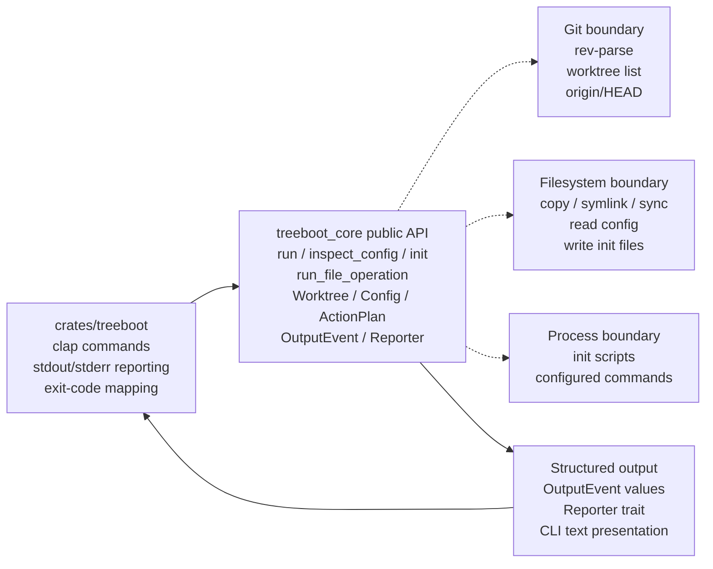
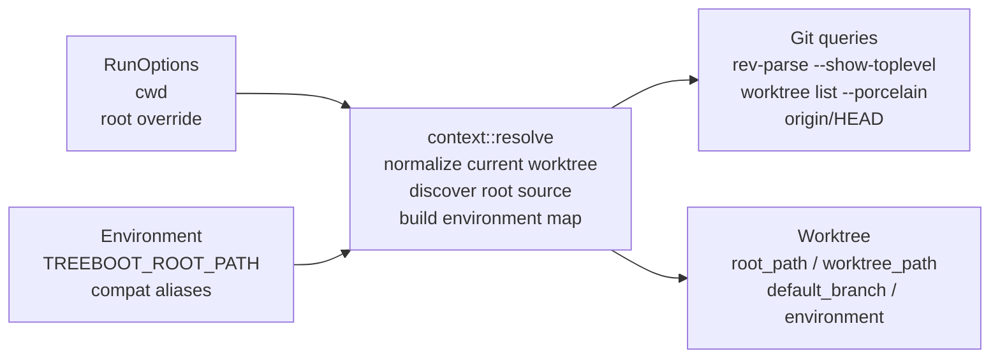
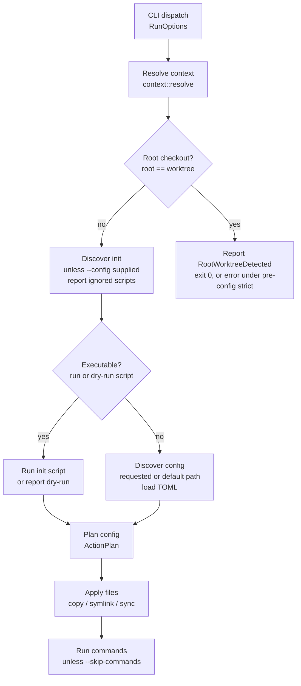
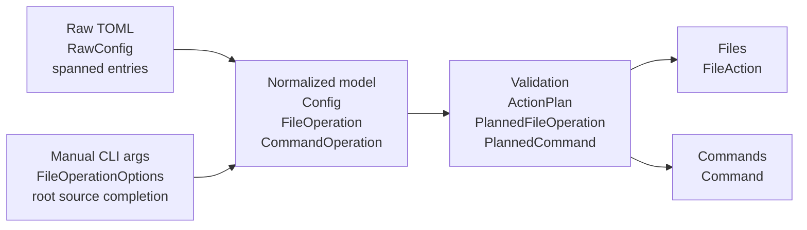
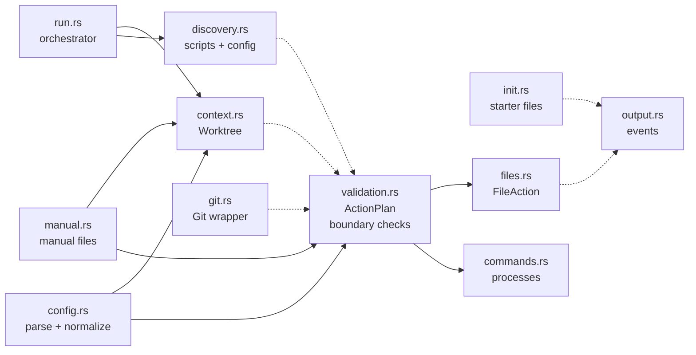

*Implementation architecture*

# treeboot Architecture

`treeboot` is a Rust CLI and public core library for bootstrapping Git worktrees from a repo-local setup contract. The binary crate owns argument parsing and presentation; the core crate owns discovery, normalization, validation, planning, and execution.

**Tags:** CLI adapter, Public core library, Validated action plans, Structured output, Git worktree anchored

*Workspace boundary*

## Crates And Responsibilities

The workspace has one thin binary crate and one reusable library crate. Keep behavior in core unless it is purely CLI presentation.

*Diagram: High-level treeboot system map. CLI arguments flow into treeboot-core APIs. Core modules call Git, filesystem, and shell process boundaries and emit output events.*



_Core owns behavior and side effects. The CLI converts arguments into core option structs and prints core output events._

### `treeboot` binary crate

- Defines `clap` commands and value enums.
- Converts CLI structs into core option structs.
- Prints `OutputEvent::message()` to stdout.
- Prints errors to stderr and maps exit codes.
- Generates shell completion registration scripts.

### `treeboot-core` library crate

- Discovers Git worktree context and repo root source.
- Discovers init scripts and config files.
- Parses and normalizes declarative TOML config.
- Builds validated `ActionPlan` values.
- Executes plans through `Executor`.
- Provides typed errors and structured output events.

*Entry points*

## Command Surface

Every command maps to a small public core API. The default `treeboot` invocation is an alias for `treeboot run`. The core API has two layers: command-shaped facade functions for full treeboot behavior, and composable primitives for callers that want to discover a `Worktree`, load a `LoadedConfig`, build an `ActionPlan`, and execute it themselves.

| CLI command | Core API | Primary modules | Side effects |
| --- | --- | --- | --- |
| `treeboot`, `treeboot run` | `run(RunOptions, Reporter)` | `run`, `context`, `discovery`, `config`, `validation`, `executor`, `files`, `commands` | May execute init scripts, apply file operations, and run configured commands. |
| `treeboot copy`, `symlink`, `sync` | `run_file_operation(FileOperationOptions, Reporter)` | `manual`, `context`, `config`, `validation`, `executor`, `files` | Applies one manual file-operation batch. Skips init scripts and configured actions, but loads config policy when present. |
| `treeboot config` | `inspect_config(ConfigOptions)` | `config`, `context`, `validation` | View-only. Prints normalized config and warns when run validation would fail. |
| `treeboot init` | `init(InitOptions, Reporter)` | `init`, `context`, `output` | Writes a starter config or executable init script. |
| `treeboot completions` | CLI-owned completion registration | `main.rs`, `manual` | Prints shell registration. Dynamic source candidates delegate to `file_operation_source_candidates`. |

*Anchors*

## Runtime Context

Almost every core flow starts by resolving the Git worktree, root source checkout, default branch, and treeboot-owned environment.

*Diagram: Worktree resolution graph. Context resolution uses cwd, optional root override, environment aliases, and Git worktree queries to build Worktree.*



_Root source precedence is explicit `--root`, then treeboot-compatible environment aliases, then Git's main worktree._

### Source root

File operation sources are anchored to `root_path`, normally Git's main worktree or an explicit override.

### Target worktree

File operation targets and command working directories are anchored to `worktree_path`.

### Environment aliases

Scripts and configured commands receive treeboot variables plus compatibility aliases for Codex, Conductor, and Superset flows.

*Primary orchestration*

## `treeboot run` Flow

Run mode first checks for root-checkout no-op behavior, then prefers executable init scripts unless a config file is explicit.

*Diagram: treeboot run orchestration flow. treeboot run resolves context, handles root checkout, discovers scripts or config, plans config, applies files, and runs commands.*



_The root-checkout branch reports `RootWorktreeDetected` and only becomes an error when pre-config strict mode is active._

*Normalized data*

## Config And Manual Pipelines

Declarative config and manual file commands converge before file effects. Config also carries planned commands.

*Diagram: Data model pipeline. Raw TOML and CLI options normalize into FileOperation values, validation builds an ActionPlan, then Executor emits OutputEvent.*



_The normalized model is intentionally separate from the validated plan. Parsing/defaulting happens before path-boundary validation._

### Declarative config path

1. `Config::discover_path` finds or validates a config path.
2. `Config::load_discovered` returns a `LoadedConfig`.
3. `Config::parse` builds `RawConfig`.
4. Normalization emits `Config` plus source spans.
5. `ActionPlan::from_manifest` validates files and commands.

### Manual file path

1. CLI converts subcommand args to `FileOperationOptions`.
2. `FileOperation::from_manual_options` validates operation-specific options.
3. Config is loaded for top-level runtime policy when present.
4. Sources and target prefix become `FileOperation`s.
5. `ActionPlan::from_file_operations` validates files.
6. `Executor::execute_files` applies or dry-runs effects.

*Core internals*

## Module Dependency Graph

The public API is re-exported from `lib.rs`; most implementation modules remain private or crate-private.

*Diagram: treeboot-core module graph. Public modules call context and discovery, config feeds validation, validation feeds files and commands.*



_`run.rs` is the broad orchestrator. Manual file commands load top-level config policy when present, skip configured commands, and reuse validation and files._

| Module | Owns | Does not own |
| --- | --- | --- |
| `context.rs` | Git-derived root/worktree/default branch and env aliases. | Config parsing, script discovery, or side effects. |
| `config.rs` | TOML parsing, defaulting, normalized config data. | Boundary validation or execution. |
| `validation.rs` | Pre-side-effect checks, path normalization, duplicate targets, strict sync rejection, command cwd/env checks. | Parsing or filesystem mutation. |
| `files.rs` | Planning concrete filesystem actions and applying copy, symlink, sync, delete, skip, warning events. | Config semantics or CLI argument validation. |
| `commands.rs` | Sequential configured command spawning and dry-run output. | Parsing command config or deciding command order. |
| `output.rs` | Structured output events and message formatting. | Choosing when events happen. |

*Filesystem effects*

## File Operation Engine

File execution is two-stage: validated file operations become concrete `FileAction`s, then actions are reported or applied depending on dry-run mode.

### Planning inside `files.rs`

- Skips optional missing sources before filesystem traversal.
- Plans copy and sync through shared tree traversal.
- Plans symlink creation and replacement separately.
- Plans sync delete actions for target-only paths.
- Adds warnings for preserved symlinks to uncopied targets.

### Applying actions

- `dry_run` emits would-apply events only.
- `force` controls supported replacements.
- `strict` converts some default skips into conflicts.
- Actual filesystem mutations happen after all actions plan.
- Reporter failures become typed output errors.

```
ActionPlan.files
  -> plan_operation
  -> FileAction::{CreateDirectory, CopyFile, CreateSymlink, Delete, Skip, Warning}
  -> report_dry_run(action) or apply_action(action)
  -> OutputEvent::{FileWouldApply, FileApplied, FileWarning, ...}
```

*Process effects*

## Command Runtime

Configured commands run sequentially in declaration order. Parallel work is intentionally delegated to project-local task runners.

### Planning

`validation.rs` resolves command cwd to the worktree, rejects cwd escapes, and prevents command env entries from overriding treeboot-owned environment variables.

### Execution

`commands.rs` builds either a shell process (`sh -c` or `cmd /C`) or a direct program invocation, then runs it in sequence.

### Failure policy

`allow_failure` turns spawn or non-zero exit failures into warning output. Otherwise failures become typed command errors and stop the run.

*Presentation*

## Output And Errors

Core reports structured events and typed errors. The CLI decides how those become stdout, stderr, and process status.

| Surface | Type | Role |
| --- | --- | --- |
| `OutputEvent` | Public enum | Captures non-error user-visible events such as config detected, file applied, command started, and init created. |
| `Reporter` | Public trait | Lets CLI and tests receive events without hard-coding stdout into the core implementation. |
| `Error` | Public enum | Represents typed failure categories for Git, config, planning, file operations, commands, init, output, and environment. |
| `StdoutReporter` | CLI adapter | Prints `OutputEvent::message()`. Errors are printed separately by `main`. |

*Verification boundaries*

## Testing Architecture

Tests are split by behavior layer. Use core unit tests for pure helpers and CLI integration tests for user-visible command behavior.

### Core unit tests

- Config parsing and normalization.
- ActionPlan validation.
- File action planning and application.
- Command labels and failure policy.
- Output event formatting.

### CLI integration tests

- Run/config/init/manual command behavior.
- Actual Git linked worktree fixtures.
- Stdout/stderr and exit status.
- Shell completion surface.
- Root-checkout edge cases.

### Generated artifacts

- JSON Schema is generated by a core example.
- `mise run generate:check` guards freshness.
- `mise run check` is normal handoff validation.
- `mise run verify` adds broader CI/coverage checks.

*Change guide*

## Extension Points And Invariants

These are the boundaries to preserve when adding new behavior or refactoring existing modules.

| If changing | Touch | Keep invariant |
| --- | --- | --- |
| Config file format | `docs/SPEC.html`, `config.rs`, schema generator, schema file, parser tests. | The spec is the contract; generated schema must be fresh. |
| File operation behavior | `config.rs`, `manual.rs`, `validation.rs`, `files.rs`, CLI tests. | Declarative config and manual commands must share planning and file execution semantics. |
| Command runtime | `config.rs`, `validation.rs`, `commands.rs`, run tests, spec. | Commands run after file operations and inherit treeboot-owned environment variables. |
| CLI-only surface | `crates/treeboot/src/main.rs` and CLI tests. | CLI stays an adapter. Core owns reusable behavior and typed semantics. |
| Output wording | `output.rs`, CLI integration tests, spec if contractual. | Structured events stay separate from command-line formatting decisions where practical. |

### Current refactor pressure

The most visible architecture debt is duplicate file-operation display and defaulting logic across config, manual operations, validation, files, output, and CLI text summaries. Consolidating those rules should improve the model without changing the pipeline described in this document.

This document describes the current implementation architecture. It is not a replacement for [docs/SPEC.html](SPEC.html), which remains the user-visible compatibility contract.
